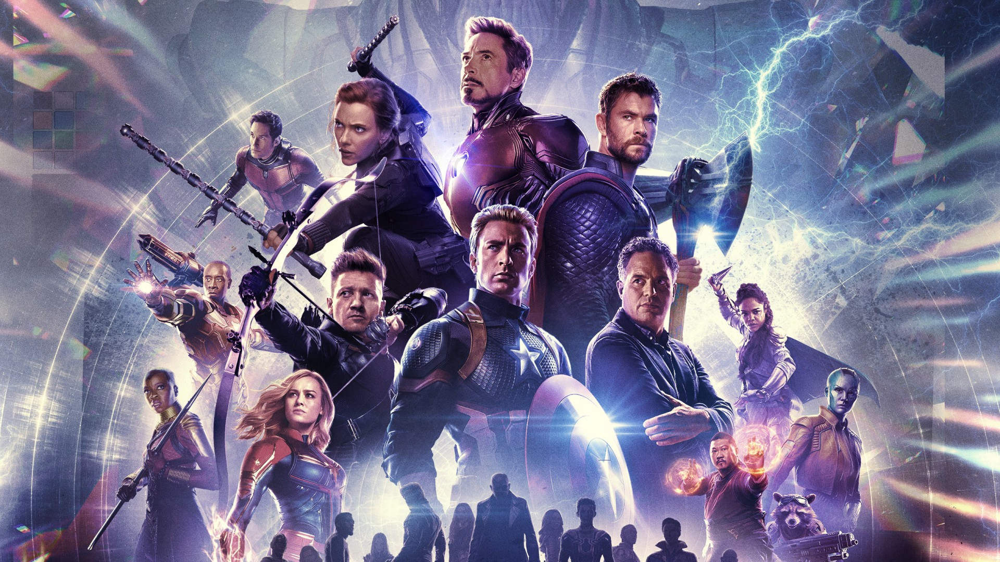

# Marvel Quiz - Which Marvel character are you? 

Answer the questions and find out which Marvel hero has a similar personality to yours.
 

## Prerequisites

You need <a href="https://www.python.org//">Python 3</a> to play.
 

## Usage

First, install Python 3.
 Second, clone the project, <code>cd</code> to your directory/download,  
and run the quiz.py file in a Python 3 shell (Terminal on a mac / Linux, Windows command prompt).
 

## Rules

You can write one of the suggested answers, or you can write your own.
 

## Choose your words wisely!

Be careful with the spelling because you can look different from your true hero identity.

Enjoy!
 

## Credits

Add points and open images from web: <a href="https://www.youtube.com/watch?v=CfeULNd5-4Q">Build a Personality Survey Pt 2 - Python 3 6 </a>
 

## License 
MIT
